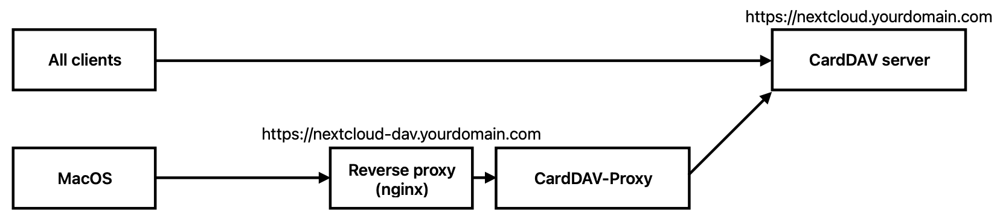
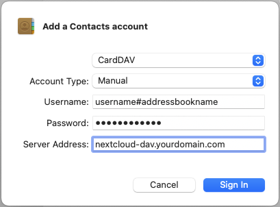

# CardDAV-Proxy

On MacOS, it is not possible to sync multiple address books from a CardDAV server. For some reason, it only syncs the
first one and no more. This is a small tool that tries to fix that problem by setting up a proxy in front of the
CardDAV server, intercepting the traffic and only returning on address book at a time.

## Disclaimers

* This tool is provided without any guarantees. My focus has been ease of development, not high performance. It is
  sufficient for my use case, though many performance improvements could be applied.
* This has been tested with MacOS Sonoma and Nextcloud 27. It is tailored to work specifically with Nextcloud, where the
  address books are available on https://nextcloud.yourdomain.com/remote.php/dav/addressbooks.
* I notice some unexpected behaviour, where every action in the CardDAV server happens twice: once without proper
  credentials, resulting in a 401 error, and then with proper credentials and succeeding. This will reduce performance,
  but because it works, I am not investigating further whether this is expected behaviour or how to fix it.

## Deployment

You need a functioning CardDAV server on a domain name, e.g. nextcloud.yourdomain.com. This proxy must be deployed on a
separate domain name, e.g. nextcloud-dav.yourdomain.com, using a reverse proxy such as nginx.



A very basic server section for nginx looks like this, this should be extended with at least some SSL configuration and
security headers.

```
server {
    listen 443 ssl http2;
    server_name nextcloud-dav.yourdomain.com;
    ssl_certificate /etc/ssl/nginx.crt;
    ssl_certificate_key /etc/ssl/nginx.key;
    ssl_protocols TLSv1.2 TLSv1.3;

    location / {
        proxy_pass http://carddav-proxy:8000/;
    }
}
```

The CardDAV-Proxy container needs the following environment variables:

* `LOG_LEVEL`: set the log level of the application, "INFO" by default. **Warning: when setting to "DEBUG", your
  credentials will be logged.**
* `THIS_SERVER`: domain of the CardDAV-Proxy, e.g. "https://nextcloud-dav.yourdomain.com".
* `UPSTREAM_SERVER`: domain of the CardDAV server, e.g. "https://nextcloud.yourdomain.com".

## MacOS account configuration

When you add a new CardDAV account, specify the username as `<your username>#<address book name to sync>`, and set the
CardDAV-Proxy domain as server address. Add one account for every addressbook you have.


